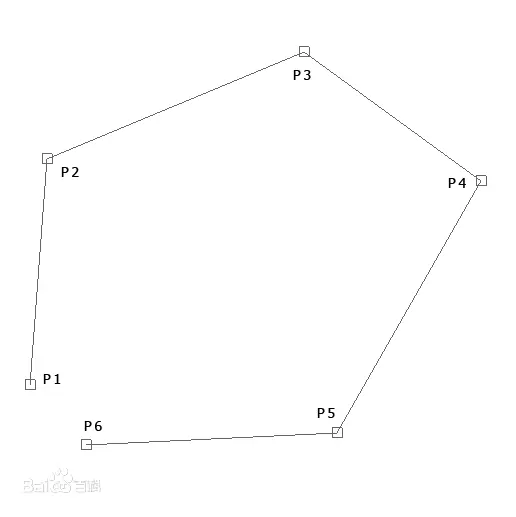
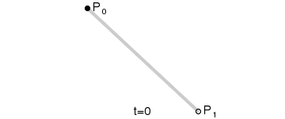
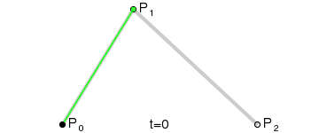

# 贝尔塞曲线

### 先导

先导都不知道写什么了，一个用来算粒子路径的算法，还是比较简单。



当然这篇文章不会为你讲解什么是贝尔塞曲线，如果你想了解什么是贝尔塞曲线的话可以去百度一下。

### 实现

首先我们来看一下一阶和二阶的贝尔塞曲线效果(诶不会真有人拿这个公式去做一阶的吧？





那么现在我们要开始分析一下百度上面的公式了。


其实还挺简单的，看起来也不是很难算。

只不过，在Minecraft中坐标直接存进计分板是不可取的，所以我们要对它进行扩大，假设我们对它扩大100倍...那么算下来的结果就是...是不是发现了就会变得非常大。已经超过了常规int值存储范围(2147483648\~-2147483648)了，计分板肯定是存不进这么大的数字的，所以我们要么对它拆分进行计算，要么缩小精度

对它拆分进行计算明显会加大计算量，所以应该采用缩小精度(看具体应用情况)，这里只需要扩大到原来坐标的10倍就可以了。

#### 指令算法讲解

```
scoreboard players set temp.1 m 1000
scoreboard players operation temp.1 m -= temp.t m
scoreboard players operation p0.x m *= temp.1 m
scoreboard players operation p0.y m *= temp.1 m

scoreboard players operation p1.x m *= temp.t m
scoreboard players operation p1.y m *= temp.t m
scoreboard players operation p1.x m += c.x m
scoreboard players operation p1.y m += c.y m
#一阶
```

这里只是一部分指令(**一阶的**

如果你要做二阶的话可以根据上面的公式来算。三阶会有点复杂(岂止有点)

三阶大概就是 **P0和P1、P1和P2、P2和P3** 看成**一阶**来算。接着用 **P0与P1** 和 **P1与P2 | P1与P2** 和 **P2与P3** 再次看成**一阶**再算，最后重复操作，把那两个的结果看成一阶再算一遍。其他阶数也是以此类推

**非常值得注意的是 阶数越大，坐标也会随着计算扩大。在三阶和之后的阶数就需要将它拆分进行计算**

### 其他

所以贝尔塞曲线还是不适合用指令来写，通过模组或者插件的方式来实现的话是挺方便的
