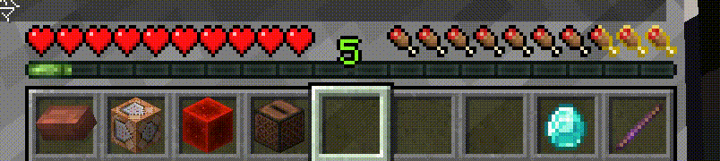
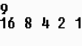

# 计分板控制经验条比例

### 先导



上面这个是我自己写的一个小函数，也是很久之前写的了。最近做了几个花里胡哨的教程，所以把这个也讲一讲吧(也挺花里胡哨的)

### 实现

首先我们要用二分法分解计分板分数，相当于把它转换成一个二进制数字。首先我举个例子，假设计分板分数为9，我们让他执行如下操作



我们就可以得到9的二进制表达式1001，然后我们根据二进制的位数再给它加回去就能得到10进制表达

用这个方法就能更方便的给予经验，不然你也可以做一个超长的递归，减一分加一点经验

在Level1的时候，经验只会被分成7份(7point)，但是gif中却能做到把它切割成非常小的单位，这是因为MC扣除等级后，相应的point不会被刷新。我们可以把玩家的经验放大到高等级，做出我们想要的比例，然后恢复至原来的等级就能做倒了。

根据[经验](https://minecraft.fandom.com/zh/wiki/%E7%BB%8F%E9%AA%8C#%E7%BB%8F%E9%AA%8C%E7%AD%89%E7%BA%A7)的说明，我们可以计算出在等级为129时，升级到下一级需要的经验值为1003，非常接近1000，适合用来做比例，此外等级为29时，升级需要的经验值是102，也比较接近100，同样适合来做。下面我为了方便所以用29级来做示范。

```
scoreboard objectives add xp dummy
#首先将玩家的point设置为0
xp set @s 0 points
#我这里偷懒所以用等级29，你想做精准一点的话请用129级那个
xp set @s 29 levels
scoreboard players set @s xp 50
execute if score @s xp matches 64.. run xp add @s 64 points
execute if score @s xp matches 64.. run scoreboard players remove @s xp 64
execute if score @s xp matches 32.. run xp add @s 32 points
execute if score @s xp matches 32.. run scoreboard players remove @s xp 32
execute if score @s xp matches 16.. run xp add @s 16 points
execute if score @s xp matches 16.. run scoreboard players remove @s xp 16
execute if score @s xp matches 8.. run xp add @s 8 points
execute if score @s xp matches 8.. run scoreboard players remove @s xp 8
execute if score @s xp matches 4.. run xp add @s 4 points
execute if score @s xp matches 4.. run scoreboard players remove @s xp 4
execute if score @s xp matches 2.. run xp add @s 2 points
execute if score @s xp matches 2.. run scoreboard players remove @s xp 2
execute if score @s xp matches 1.. run xp add @s 1 points
execute if score @s xp matches 1.. run scoreboard players remove @s xp 1
xp set @s 0 levels
```

### 运用

至此你已经学会了控制经验条的比例了，那么剩下的增长对你来说就不难了\~

